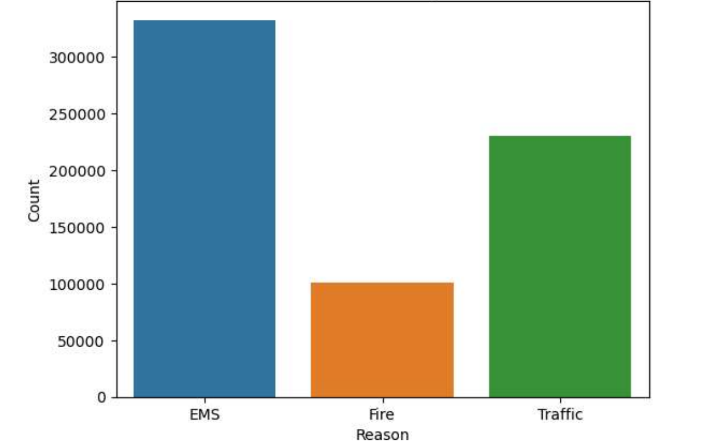
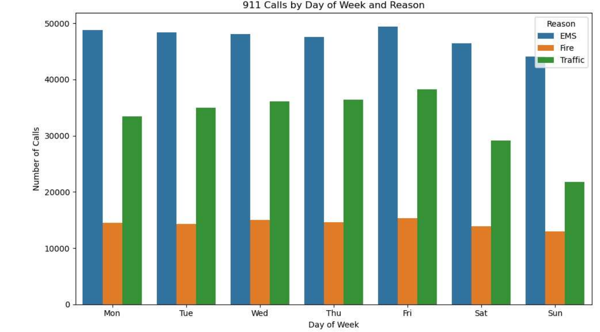
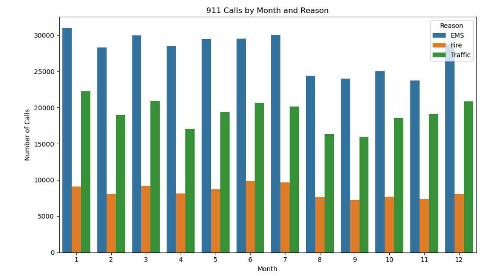
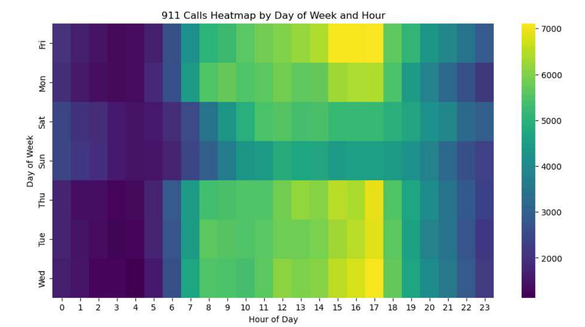

# 911 Calls Analysis Project

## Project Overview
This project analyzes a real-world 911 emergency calls dataset using Python in Jupyter Notebook. The aim was to uncover patterns in emergency call activity by examining time, location, and reason for calls, with the goal of supporting better decision-making for public safety and emergency response planning.

## Executive Summary
This analysis explored 663,522 emergency calls to identify the most common reasons for calls, peak days and hours of activity, monthly trends, and the townships and zip codes with the highest call volume. The findings show that EMS calls dominate the dataset, that call activity peaks in the afternoon and evening, and that certain locations consistently report more emergency incidents than others.

### Business Problem
Emergency services often need to understand where and when demand is highest in order to allocate resources efficiently and improve response readiness.

### Objectives
- Identify the most common reasons for 911 calls.
- Determine which days, months, and hours have the highest call activity.
- Find the townships and zip codes with the greatest number of calls.
- Use visual analysis to reveal trends that can support operational planning.

## Methodology
The analysis followed a structured data exploration workflow:
1. Loaded the dataset into a Pandas DataFrame.
2. Inspected the structure, columns, and basic statistics.
3. Created new features such as Reason, Hour, Month, and Day of Week.
4. Used a dictionary mapping to convert numeric weekday values into readable day names.
5. Grouped and counted calls by reason, day, month, township, and zip code.
6. Visualized the results using count plots, line plots, heatmaps, and clustermaps.

## Results and Insights
### 1. Major Reasons for 911 Calls
EMS (Emergency Medical Services) was the most common reason for 911 calls, followed by Traffic and Fire.

### 2. Day and Time Trends
The highest volume of calls occurred on Fridays, followed by Mondays and Tuesdays. Most calls were concentrated during the afternoon and evening hours, especially between around 3 PM and 6 PM.

### 3. Monthly Patterns
There were noticeable differences in call volume across months, suggesting seasonal or time-based variation. Some months had lower call activity, which was further examined using line plots and other visual tools.

### 4. Location Insights
Certain townships and zip codes received more calls than others. The top townships identified in the analysis were:
- LOWER MERION - 55,490
- ABINGTON - 39,947
- NORRISTOWN - 37,633
- UPPER MERION - 36,010
- CHELTENHAM - 30,574

The most frequently appearing zip codes included:
- 19401
- 19464
- 19403
- 19446
- 19406

### 5. Visualization Insights
Heatmaps and clustermaps were used to explore relationships between day of week and hour, day of week and month, and week and hour. These visualizations highlighted consistent call patterns during certain periods of the week and day.

## Business Recommendations
Based on the findings, emergency response teams could improve planning by:
- Allocating more resources during peak hours and days such as Friday afternoons and evenings.
- Paying closer attention to high-volume locations such as Lower Merion and Abington.
- Preparing for EMS-related demand as the most common incident type.

## Tools Used
- Python
- Jupyter Notebook
- Pandas
- NumPy
- Matplotlib
- Seaborn

## Skills Demonstrated
This project demonstrates skills in:
- Data cleaning and preprocessing
- Exploratory data analysis (EDA)
- Feature engineering
- Data visualization
- Pattern discovery and insight generation
- Communication of analytical findings

## Summary of Findings
This project helped to better understand when, why, and how often people call 911. By using Python and visualization libraries such as Seaborn and Matplotlib, important patterns in emergency call behavior were identified.

The insights from this analysis could be valuable for emergency services in improving response planning, resource allocation, and operational efficiency.

## Next Steps
Potential next steps for this project include:
- Expanding the analysis to include year-over-year trends.
- Investigating weather or seasonal factors that may influence call volume.
- Building predictive models to forecast emergency call demand by time and location.
- Adding interactive dashboards for easier exploration of the data.

## Final Thoughts
Overall, this analysis demonstrates how data analytics can be used to uncover meaningful trends in public safety data. The project shows how time-based and location-based patterns can provide useful information for decision-making in emergency response systems.

## Project Files
- Dataset: [911_calls_dataset.csv](911_calls_dataset.csv)
- Notebook: [911_calls_analysis_project.ipynb](911_calls_analysis_project.ipynb)
- PDF report: [911_calls_analysis_exploratio_with_python.pdf](911_calls_analysis_exploratio_with_python.pdf)
