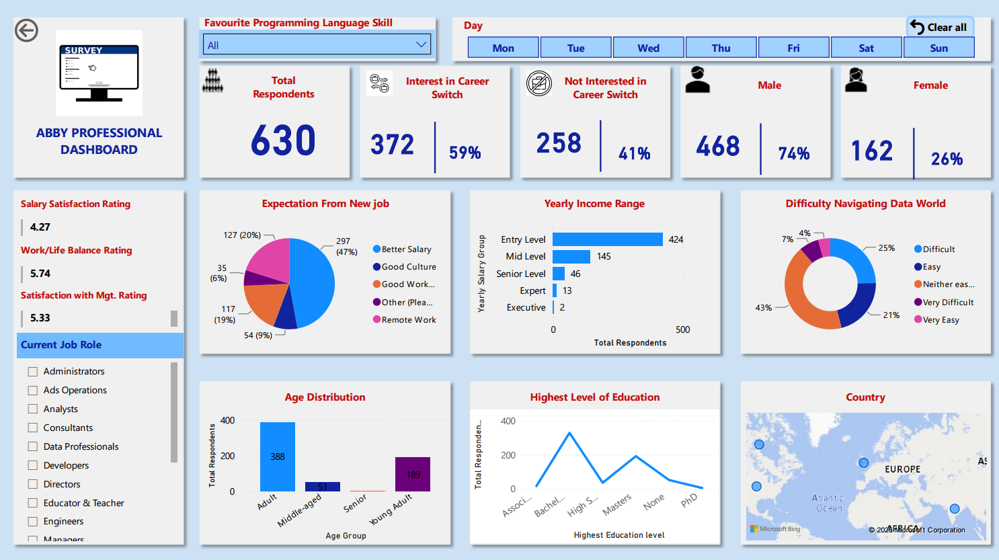

# Data Professional Survey Dashboard

## Project Overview
This project analyzes survey responses from 630 data professionals to reveal key trends in career transition interest, salary satisfaction, work-life balance, education, skills demand, and geographic representation. The interactive Power BI dashboard visualizes the findings and delivers actionable insights for HR, career advisors, and business leaders.

## Executive Summary
The dashboard shows that 59% of respondents are interested in switching careers, driven primarily by compensation and company culture. The survey is dominated by early-career professionals, especially those with bachelor’s degrees and Python skills, making the results particularly valuable for entry-level recruitment and early-career development strategies. Salary satisfaction is low, while work-life balance and management satisfaction are only moderate, underscoring a need for stronger talent retention programs.

## Business Questions
- Why are so many data professionals considering a career switch?
- Which workforce segments are experiencing the greatest dissatisfaction?
- What are the most important job expectations for professionals seeking a new role?
- How does education level influence workforce composition and training needs?
- What are the gender and geographic representation trends in the dataset?
- How can HR and business leaders improve retention and recruitment within the data profession?

## Methodology
- Cleaned and transformed raw survey data using Power Query and Power BI.
- Removed irrelevant columns and standardised inconsistent job role categories.
- Converted open-text responses into consistent categories using text matching and labelling.
- Grouped age into bands and defined salary categories for structured analysis.
- Extracted weekday names and sort-order values to ensure chronological slicer behaviour.
- Preserved data integrity by handling null and blank values carefully, labelling unknown entries rather than discarding records.
- Created DAX measures and calculated columns to support highly interactive visuals and drill-through analysis.
- Designed a dashboard with clear, actionable visuals and intuitive navigation.

## Skills Demonstrated
- Data cleaning and transformation in Power Query
- DAX measure creation and calculated column modelling
- Dashboard design for strategic storytelling
- Data categorisation and text standardisation
- Survey analytics and workforce segmentation
- Business insight generation from quantitative and qualitative patterns
- Interactive report design with drill-through and slicers

## Results and Insights
- Total respondents: 630 professionals.
- Career switch interest: 59% want to change roles; 41% are not interested.
- Gender split: 74% male, 26% female, indicating a gender representation skew.
- Career stage skew: 67% are entry-level, with only a small share in senior and executive roles.
- Most popular job category: data professional roles such as data analyst and data scientist.
- Programming preference: Python is the dominant skill, reflecting strong market demand.
- Education level: bachelor’s degree is most common, followed by high school and master’s.
- Employee experience ratings: salary satisfaction 4.27/10, work-life balance 5.74/10, management satisfaction 5.33/10.
- Job change motivators: better salary (47%), good work culture (19%), remote work (10%).
- Age distribution: early-career and mid-career professionals dominate the sample.
- Geography: majority from Europe and North America, with smaller representation in Africa and Asia.
- Data world accessibility: 43% find it difficult to break into data, while 25% find it very difficult.

## Business Recommendation
- Prioritise competitive compensation packages and transparent career paths to reduce turnover.
- Strengthen company culture, remote work options, and employee engagement initiatives.
- Build targeted recruiting and upskilling programs for bachelor’s-degree holders and early-career talent.
- Launch data literacy and mentoring programs to support professionals who find the field difficult to enter.
- Tailor retention strategies for Western-heavy respondent groups while adapting policies for broader global applicability.

## Next Steps
- Expand the dataset to include more senior-level professionals for broader trend coverage.
- Add regional dashboards to compare Europe, North America, Africa, and Asia more precisely.
- Incorporate additional survey questions on benefits, career development, and leadership support.
- Validate findings with follow-up surveys and qualitative interviews.
- Enhance the dashboard with predictive analytics or scenario planning for workforce retention.

## Tools Used
- Power BI Desktop
- Power Query
- DAX

## Project Files
- [Power BI report (`.pbix`)](Data_professional_survey_interactive_dashboard.pbix)
- [Insights overview PDF](Data_professional_survey_dashboard_and_insights_overview.pdf)
- [Survey dataset (`.xlsx`)](Data_professional_survey_dataset.xlsx)

---
