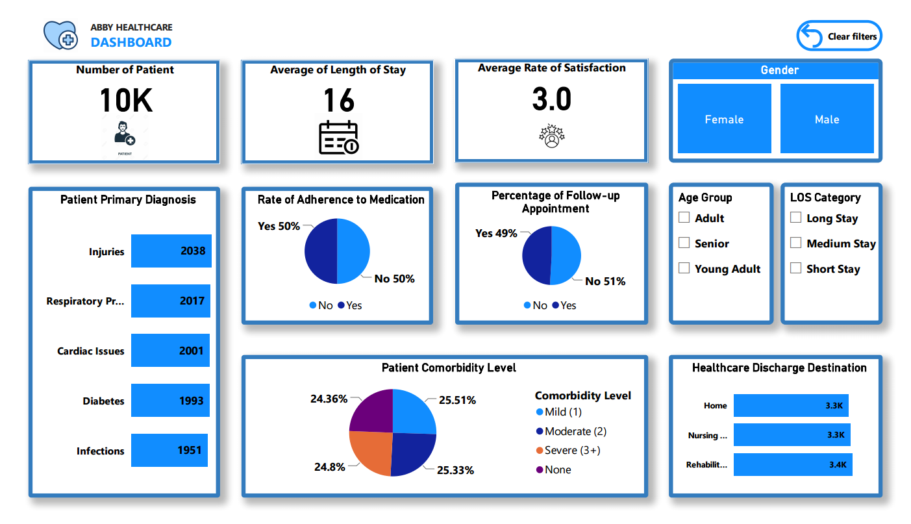

# Healthcare Dashboard Project on Power BI

## Project Overview
This project involved designing and developing an interactive Power BI dashboard to analyze hospital patient data and support decision-making for healthcare managers. The dashboard highlights key trends in patient demographics, treatment adherence, department performance, and resource utilization, with a focus on length of stay (LOS) and patient satisfaction.

## Executive Summary
The dashboard provides a consolidated view of patient care performance across departments. It reveals that most patients are adults and seniors, male patients slightly outnumber females, and more than 80% of patients have long LOS. Patients with two or more comorbidities tend to experience longer stays, indicating a stronger need for targeted care planning and resource allocation.

## Business Problem / Objectives
The primary objective of this project was to answer the following questions:
- Which patient groups are driving higher hospital resource use?
- How do comorbidities affect LOS and treatment outcomes?
- Which departments are performing well, and where are the care gaps?
- How can patient satisfaction and medication adherence be improved?

## Methodology
1. Imported and cleaned the healthcare dataset in Power BI.
2. Created calculated columns to classify comorbidities as None, Single, Double, or Multiple.
3. Built age-group categories such Young Adult, Adult, and Senior.
4. Designed KPI cards, slicers, bar charts, and pie charts to surface important trends.
5. Added a Clear Filters button and an Insights page to improve usability and communicate findings effectively.

## Skills Demonstrated
- Power BI dashboard design
- Data modeling and transformation
- DAX calculations
- Data visualization best practices
- Interactive report development with slicers and bookmarks
- Insight storytelling and business reporting

## Results and Insights
- Adults and seniors made up most of the patient population.
- Male patients slightly outnumbered female patients.
- More than 80% of patients had long LOS.
- Chronic conditions and multiple comorbidities were the most common primary diagnoses.
- Patients with three or more comorbidities contributed the most to increased hospital resource use.
- Approximately 50% of patients did not adhere to medication, highlighting a care-follow-through gap.
- The average satisfaction score was 3.0 out of 5.0, indicating moderate but improvable treatment experience.
- Departments treating injuries served the highest number of patients, while departments with strong follow-up engagement tended to show better satisfaction and adherence results.

## Business Recommendation
Healthcare managers should prioritize interventions for patients with multiple comorbidities, especially those with extended LOS, by improving discharge planning, medication adherence support, and care coordination. Departments that already show strong follow-up engagement should be used as models for improving patient satisfaction and treatment outcomes.

## Next Steps
- Expand the dashboard with additional clinical and financial KPIs.
- Add trend analysis over time to identify seasonal or cohort-based patterns.
- Incorporate predictive insights for readmission risk and LOS forecasting.
- Share the dashboard with department leads for operational review and decision-making.

## Tools Used
- Microsoft Power BI
- DAX
- Power Query
- Data visualization and dashboard design principles

## Project Files
- [Healthcare_interactive_dashboard.pbix](Healthcare_interactive_dashboard.pbix)
- [Healthcare_interactive_dashboard_overview_and_insights.pdf](Healthcare_interactive_dashboard_overview_and_insights.pdf)
