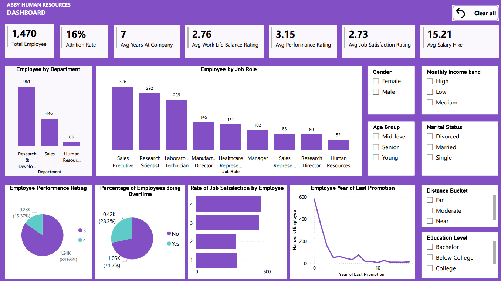

# HR Analytics Dashboard – Power BI Project

## Project Overview
This project focuses on building an interactive Human Resources analytics dashboard in Power BI to help HR leaders and business stakeholders better understand workforce trends, identify attrition risks, and support data-driven people strategy decisions. The dashboard transforms raw HR data into a clear executive reporting view covering employee demographics, attrition, compensation, performance, tenure, and work-life balance.

## Executive Summary
The dashboard reveals that employee attrition is a meaningful business concern, with an overall attrition rate of approximately 16%. The highest attrition is observed among younger employees under 30, single employees, and employees in the Sales department, particularly Sales Representatives. Employees living farther from work also show elevated turnover, while lower work-life balance scores are associated with higher attrition. The analysis also suggests that compensation is not strongly aligned with performance, indicating an opportunity to review salary structures and career progression practices.

### Business Problem
HR teams often lack a consolidated view of workforce health, making it difficult to identify which employee groups are most at risk of leaving and where retention actions should be prioritised.

### Key Questions
- Which employee segments experience the highest attrition?
- How do age group, gender, distance from work, and marital status influence turnover?
- Which departments and job roles need the most retention focus?
- Are employee performance and compensation aligned?
- Are promotion opportunities and work-life balance contributing to retention outcomes?

## Methodology
1. Data Collection and Preparation: Imported the HR analytics dataset and reviewed the structure for quality issues.
2. Data Cleaning and Transformation: Used Power Query to restructure a malformed dataset that initially contained all values in a single column.
3. Data Standardisation: Mapped education levels from numeric values to meaningful categories such as Below College, College, Bachelor, Master, and Doctorate.
4. KPI Development: Defined key measures such as attrition rate, headcount, average monthly income, and employee segmentation metrics.
5. Dashboard Design: Built an interactive report with filters, bookmarks, and a visual hierarchy to support executive and operational analysis.
6. Insight Generation: Interpreted the visual outputs to identify workforce patterns and recommend retention strategies.

## Skills Demonstrated
- Data cleaning and transformation using Power Query
- Data modelling and DAX measure creation
- Power BI dashboard design and storytelling
- Business intelligence and KPI development
- Data analysis for HR and workforce planning
- Portfolio-ready reporting and visualisation presentation

## Results and Insights
- The majority of employees fall within the 30–40 age group.
- The workforce is approximately 60% male and 40% female.
- Research and Development has the largest staff population.
- The overall attrition rate is approximately 16%.
- Younger employees, single employees, and employees in Sales roles show the highest attrition.
- Employees living more than 15 km from work have the highest turnover risk.
- Lower work-life balance scores are linked to higher attrition.
- More than 40% of employees have not been promoted in the last five years.
- Most employees fall within the medium income band, and salary does not appear to strongly correlate with performance rating.

## Business Recommendations
- Prioritise retention initiatives for younger employees, single employees, and employees in Sales-related roles.
- Review commute-related concerns and improve support for employees living farther from work.
- Strengthen work-life balance policies and employee wellness initiatives to reduce turnover risk.
- Improve career progression and promotion planning to increase employee engagement and retention.
- Reassess compensation practices to ensure salaries better reflect performance and market expectations.

## Next Steps
- Add predictive analytics to forecast future attrition risk.
- Expand the dashboard with recruitment, engagement, absenteeism, and employee satisfaction metrics.
- Connect the dashboard to live HR data systems for real-time monitoring.
- Develop department-specific action plans based on the insights generated.

## Tools Used
- Microsoft Power BI
- Power Query
- DAX
- CSV / Excel-based data preparation
- PDF and image export for reporting and portfolio presentation

## Project Files
- [HR_Analytics_Data_raw.csv](HR_Analytics_Data_raw.csv)
- [Hr_interactive_dashboard_on_PowerBi.pbix](Hr_interactive_dashboard_on_PowerBi.pbix)
- [HR_dashboard_and_insights_overview.pdf](HR_dashboard_and_insights_overview.pdf)
