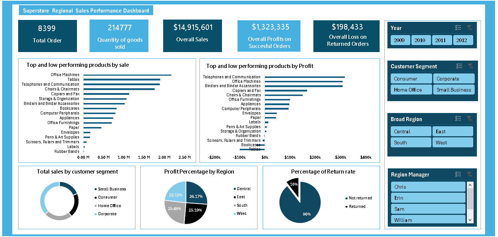

# 📊 Superstore Regional Sales Performance Analysis & Dashboard

[](#tools-used)
[](#project-overview)

---

## Project Overview
The **Superstore Regional Sales Performance Analysis** is a comprehensive commercial analytics project evaluating **8,399 transactions** across 4 years (2009–2012). The primary goal of this project is to evaluate product line profitability, identify hidden operational losses, analyze regional and customer segment dynamics, and quantify the revenue impact of product returns.

By translating raw transactional data into structured insights and an **interactive Excel dashboard**, this project provides senior leadership with clear, data-driven strategies to eliminate profit leakage and optimize product-mix offerings.

---

## Executive Summary

Across the 4-year analysis period, the Superstore achieved substantial top-line revenue but faced margin compression due to specific product line losses and order returns.

### Key Performance Indicators (KPIs)
| KPI Metric | Value | Description |
| :--- | :--- | :--- |
| **Total Orders** | **8,399** | Total customer purchase orders processed |
| **Quantity Sold** | **214,777 units** | Total product volume distributed |
| **Overall Revenue (Sales)** | **$14,915,601** | Total top-line gross revenue generated |
| **Profit on Successful Orders** | **$1,323,335** | Net profit realized from completed orders |
| **Loss on Returned Orders** | **$198,433** | Financial revenue drain from returned products |
| **Overall Return Rate** | **10.0%** | Proportion of total orders returned |

---

## 🖥️ Executive Interactive Dashboard Preview

> Below is the fully interactive Excel executive dashboard featuring dynamic slicers (Year, Customer Segment, Broad Region, Region Manager), custom KPI summary cards, revenue/profit breakdown charts, and return rate diagnostics.



*Figure 1.1: Superstore Regional Sales Performance Executive Dashboard in Microsoft Excel.*

---

## Business Problem & Objectives

### The Business Challenge
While Superstore experienced strong top-line sales ($14.9M+), net profitability was hindered by unmonitored loss-leader products, inconsistent discounting structures, and a **10% return rate** draining nearly **$200,000** in potential profits. Management lacked consolidated visibility into which products and regions were driving true profit versus those driving volume at a net loss.

### Core Objectives
1. **Product Profitability Analysis**: Distinguish top revenue drivers from top net profit contributors and pinpoint loss-making product categories.
2. **Regional & Segment Evaluation**: Assess sales and profit distribution across the Central, East, South, and West regions and evaluate performance across Consumer, Corporate, Home Office, and Small Business segments.
3. **Return Rate Diagnostics**: Quantify total revenue loss from product returns and identify regional manager associations to reduce return friction.
4. **Actionable Recommendations**: Formulate strategic pricing, discount, and inventory control strategies to maximize future margins.

---

## 🛠️ Methodology

The analysis followed a structured 5-stage analytics workflow:

```
┌─────────────────┐     ┌──────────────────┐     ┌───────────────────┐     ┌───────────────────┐     ┌───────────────────┐
│ 1. Data Cleaning │ ──> │ 2. Transformation│ ──> │ 3. Pivot Modeling │ ──> │ 4. Dashboard UI   │ ──> │ 5. Insights & Recs │
│  & Validation   │     │  & Calculations  │     │  & Aggregations   │     │  Design & Slicers │     │  Strategy Report  │
└─────────────────┘     └──────────────────┘     └───────────────────┘     └───────────────────┘     └───────────────────┘
```

1. **Data Ingestion & Cleaning**: Audited `Superstore_db_raw.xlsx` (8,399 records), checked for missing fields, sanitized data types, and validated numerical consistency.
2. **Data Transformation & Feature Engineering**: Standardized product categorization, calculated return flags, and established logical relationships between orders, returns, and regional managers.
3. **Pivot Table & Data Modeling**: Developed custom Pivot Tables in Excel to aggregate sales, profit, and returns by year, region, customer segment, product line, and sales manager.
4. **Interactive Dashboard Construction**: Engineered a visual dashboard interface utilizing native Excel charts, custom color palettes, KPI cards, and dynamic cross-filtering Slicers.
5. **Insights Synthesis**: Interpreted quantitative output to formulate targeted commercial recommendations for executive stakeholders.

---

## Results & Key Insights

### 1. Product Performance: Revenue vs. Profitability Disconnect
A critical finding of this analysis is that **high sales volume does not guarantee high profitability**.

* **Top Performers by Sales Volume**:
  1. Office Machines (~$2.2M)
  2. Tables (~$1.9M)
  3. Telephones and Communication (~$1.8M)
  4. Chairs & Chairmats (~$1.7M)
  5. Copiers and Fax (~$1.1M)

* **Top Performers by Net Profit**:
  1. Telephones and Communication (~$310K)
  2. Office Machines (~$305K)
  3. Binders and Binder Accessories (~$300K)
  4. Copiers and Fax (~$165K)
  5. Chairs & Chairmats (~$150K)

* **Severe Loss Leaders**:
  * **Tables**: Despite generating **~$1.9M in sales** (2nd highest seller), Tables incurred a staggering net loss of **-$195,000**, making it the single largest profit drain in the business. This severe margin erosion is attributed to deep discounting, high shipping costs, and inefficient supplier pricing.
  * **Bookcases**: Secondary loss leader, generating **-$15,000** in net losses.
  * **Low-Margin Categories**: Scissors, Rulers and Trimmers, Rubber Bands, and Envelopes contributed negligible margins despite operational overhead.

### 2. Customer Segment Dynamics
* **Corporate Segment**: Primary revenue engine, contributing the highest total sales volume across 2009–2012.
* **Consumer & Home Office**: Showed steady demand with consistent margins.
* **Small Business**: Represented a growing customer base requiring tailored bulk discounting tiers.

### 3. Regional Profit Distribution
Profitability is remarkably balanced across all four geographical zones, indicating healthy nationwide brand presence:
* **Central Region**: 26.17% of total profit
* **South Region**: 25.49% of total profit
* **East Region**: 25.19% of total profit
* **West Region**: 23.15% of total profit

### 4. Product Returns Financial Drain
* **10.0% Total Return Rate**: 10 out of every 100 orders were returned, causing **$198,433** in direct revenue losses.
* **Managerial Variance**: **Sam** (South Region Manager) was associated with elevated return frequencies compared to peers (Chris, Erin, William), highlighting potential fulfillment, packaging, or customer expectation gaps in the South territory.
---

## 🚀 Business Recommendations

1. **Restructure Pricing & Discounts on Tables**:
   * Immediately audit discount thresholds for the **Tables** product line. Set a minimum margin floor and cap promotional discounting.
   * Renegotiate freight and shipping charges for heavy furniture items like Tables and Bookcases.

2. **Capitalize on High-Margin Categories**:
   * Prioritize marketing push and inventory allocation for **Telephones & Communication**, **Office Machines**, and **Binders & Accessories**, which yield high margins per unit.

3. **Institute Return Reduction Program**:
   * Investigate root causes for returns in the **South region** (managed by Sam). Audit order fulfillment accuracy, product descriptions, and transit damage rates.
   * Target a 2% reduction in order return rates (from 10% down to 8%), which would recover approximately **~$40,000 annually** directly to net profit.

4. **Segment-Specific Commercial Strategies**:
   * Develop dedicated loyalty/volume-tier incentives for **Corporate** customers to lock in recurring high-volume orders.

---
## 💡 Skills Demonstrated

* **Advanced Excel & Data Modeling**: Pivot Tables, Calculated Fields, Nested Logic, Conditional Aggregations, Slicer Connections.
* **Data Visualization & UI/UX Design**: Clean visual hierarchy, color-coded metric cards, diverging bar charts, and layout optimization for decision-makers.
* **Financial & Margin Analysis**: Revenue vs. Profit margin analysis, loss-leader detection, return loss accounting.
* **Root Cause Diagnostics**: Uncovering hidden profitability drains (e.g., high revenue volume masking severe product losses).
* **Commercial Strategy & Storytelling**: Translating raw data metrics into C-suite executive summary reports and strategic recommendations.

---


## 🔮 Next Steps & Future Enhancements

* [ ] **Predictive Return Analytics**: Build a predictive machine learning classification model to identify orders with a high probability of return prior to shipment.
* [ ] **RFM Customer Segmentation**: Perform Recency, Frequency, and Monetary (RFM) analysis on customer accounts to identify high-value enterprise clients.
* [ ] **Automated BI Integration**: Migrate Excel data models into **Power BI / Tableau** with automated refresh connections for real-time executive reporting.

---

## Tools Used

| Tool / Technology | Purpose / Application |
| :--- | :--- |
| **Microsoft Excel** | Primary analytical engine for Data Validation, Pivot Tables, Formulas, and Dynamic Slicers |
| **Excel Data Visualization** | Custom Dashboard UI/UX, Diverging Bar Charts, Donut Charts, and Pie Charts |
| **PDF Reporting** | Executive Summary Document Export (`.pdf`) |
| **Markdown** | Comprehensive Documentation & GitHub Portfolio Presentation |

---

## 📁 Project Files

All core project deliverables are available in this repository:

* 📊 [**Superstore_regional_sales_performance_analysis.xlsx**](Superstore_regional_sales_performance_analysis.xlsx) — Main Excel workbook containing cleaned data, Pivot Tables, calculated fields, and the interactive dashboard.
* 🖼️ [**Superstore_regional_sales_performance_analysis_dashboard.png**](Superstore_regional_sales_performance_analysis_dashboard.png) — High-resolution dashboard screenshot for portfolio previews.
* 📄 [**Superstore_regional_sales_performance_analysis.pdf**](Superstore_regional_sales_performance_analysis.pdf) — Printable executive summary document.
* 🗄️ [**Superstore_db_raw.xlsx**](Superstore_db_raw.xlsx) — Original raw dataset (8,399 order rows).
* 📝 [**readme.md**](readme.md) — Project documentation file.

---
*Created by Abby | Data Analysis Portfolio Project*

